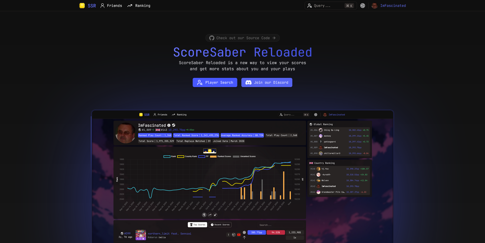
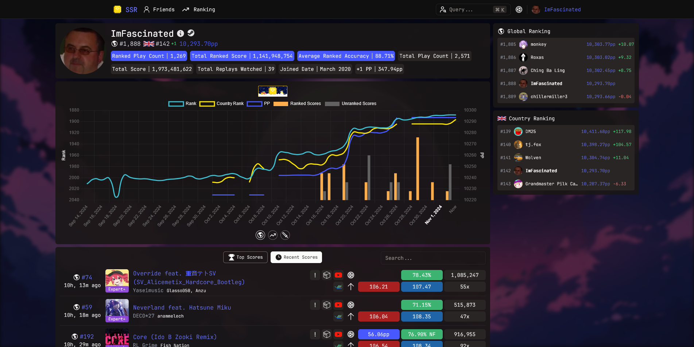

# ScoreSaber Reloaded 🎮

> [!IMPORTANT]
> This project is a work-in-progress. If you have an issue, please create one [here](https://github.com/RealFascinated/scoresaber-reloaded/issues/new).

ScoreSaber Reloaded is a new way to view your scores and get more stats about you and your plays. 🌟 Users, go to [ssr.fascinated.cc](https://ssr.fascinated.cc) to view the app.

## Table of Contents 📚

- [Features](#features)
- [App Preview](#app-preview)
- [Stars](#stars)
- [Support](#support)
- [Contributing](#contributing)
- [License](#license)

## Features ✨

See [contributing](#contributing-) for more information about contributing to this project.

- BeatLeader Integration
- Friends
- Additional Statistics
- PP Utilities
- Open API
- User Profiles
- Leaderboard Comparisons
- Score History Tracking
- Custom Playlists
- Leaderboard Statistics Dashboard
- OBS Overlay

## App Preview 📸

## Stars ⭐

## Support 🤝

Looking for support? Join the [**Discord**](https://discord.gg/kmNfWGA4A8) or contact **fascinated7** on Discord.

## Contributing 🤗

We welcome contributions! Please read our [contributing guidelines](CONTRIBUTING.md) for more information.

## License 📄

This project is licensed under the MIT License - see the [LICENSE](LICENSE) file for details.
